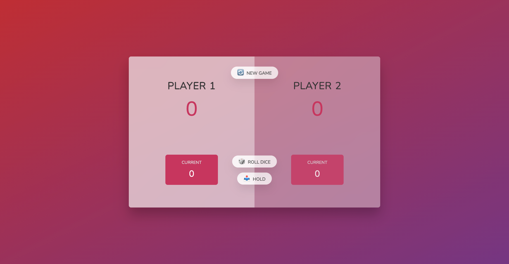

# pig-game

A fun interactive two-player game that allows users to roll a until a designated number of points (100) is reached. The players take turns rolling and accumulating points. If a 1 is rolled, the current points are lost and that player's turn is forfeited. If the player selects 'hold' the currents points accumulated are added to the player's total points. The game stops after 100 is reached by either player and players can select 'new game' to begin playing again.
